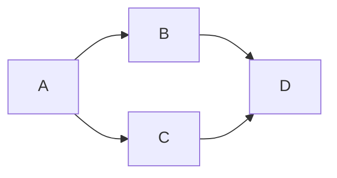
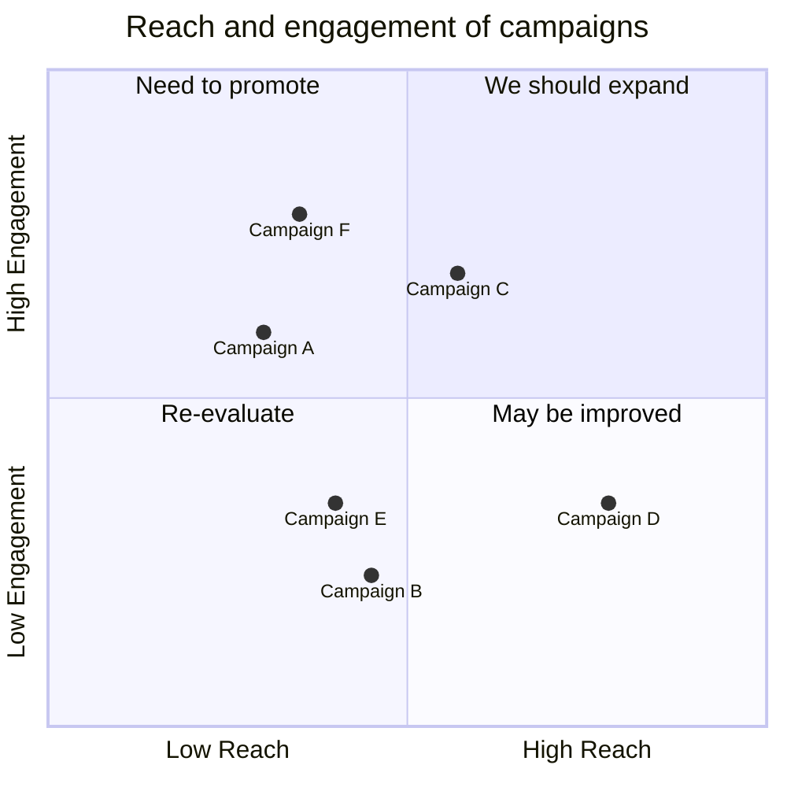
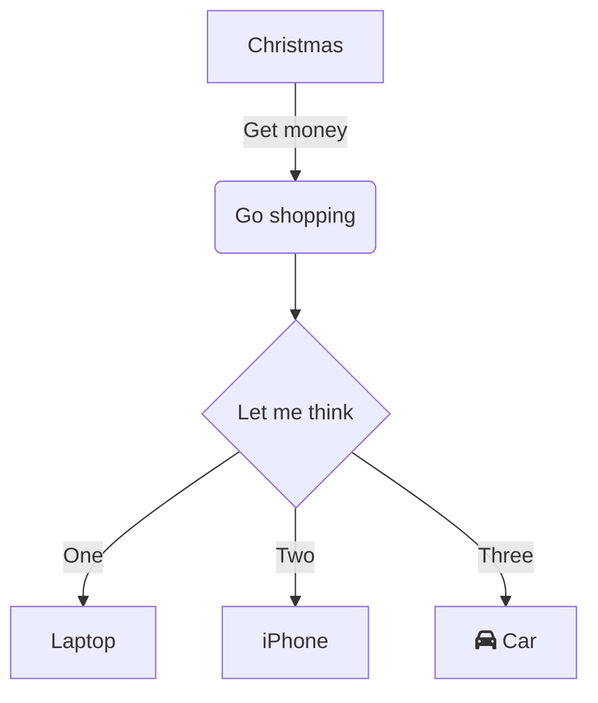
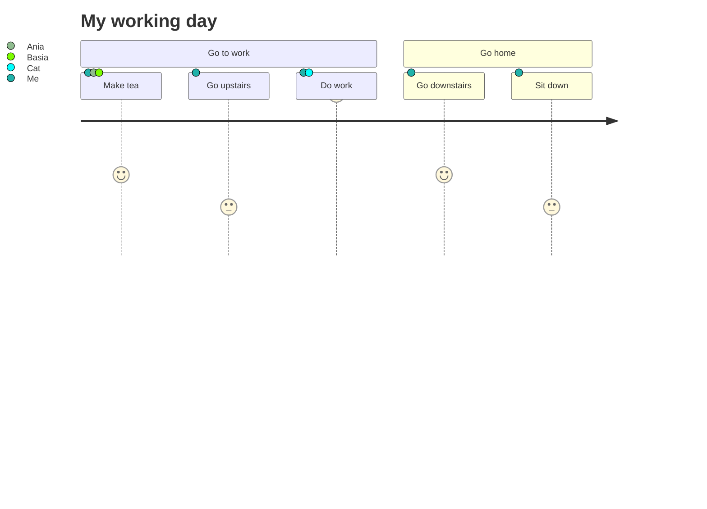
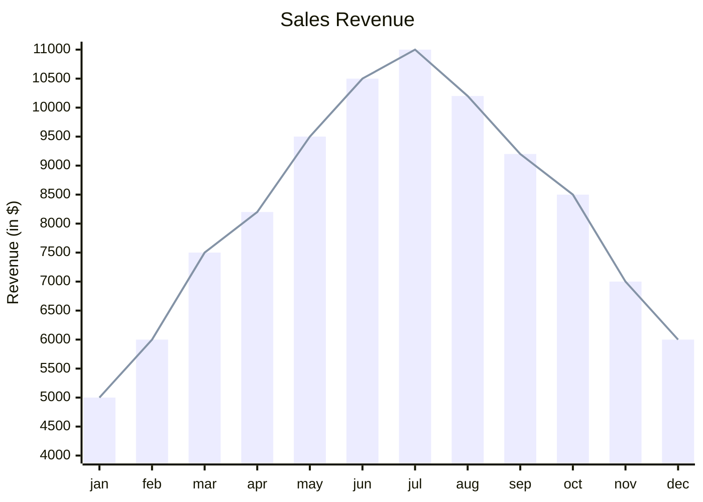

# Hello world!

Whats up
Cos dalej

*Krzywy tekst*  
**Pogrubiony tekst**  
_krzywy tekst inaczej_  
**_krzywy gruby tekst_**  
***krzywy gruby tekst inaczej***

## Punkty i listy

- Punkt 1
- Punkt 2
* Punkt 3
* Punkt 4 _**pogrubiony**_

1. Pierwszy punkt listy  
Witam cos tam cos tam  
cos cos  
cos cos jeszcze
2. Witam jeszcze raz
3. 
4. 
5. 

:car:

:cat:

_Adam Mickiewicz_ powiedział kiedyś 
>**Litwo ojczyzno moja**
>
>Ty jesteś jak zdrowie
> * Ile cię trzeba cenić
> - Ten tylko się dowie
> 1. Co cię stracił

[^1]: My_reference.

[zmienna1]: https://www.google.com

Here is a footnote[^1]. With some additional text after it.

[linkacz](zmienna1)


2^3^

$x+12$ zapis matematyczny x+12

$$\int_{-\infty}^\infty e^{-x^2} = \sqrt{\pi}$$

Kod jakiś `int main()` tutaj napisalem

```python
#Block code
for i in range(1,10):
    Do_something()
```
```
#zwykly blok kodowy bez koloru
```











